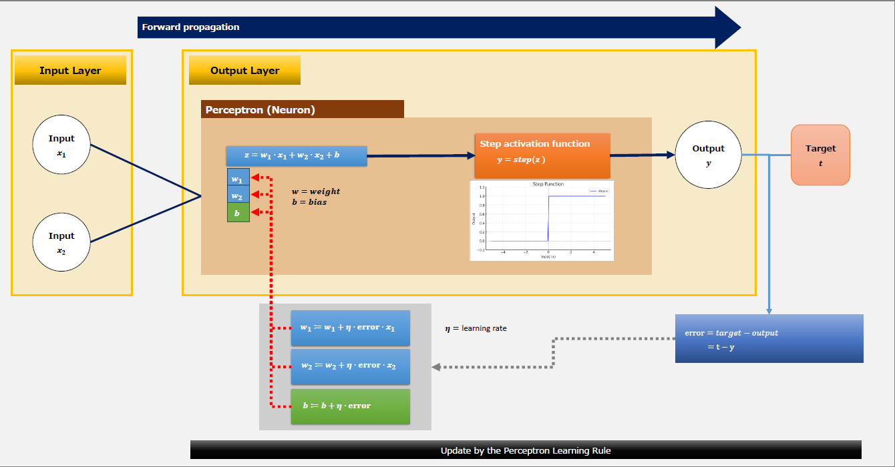

# 🛠 Step-by-Step: Building an AND Gate


## 📝 Overview
This project demonstrates how to implement a single AND gate using a single-layer perceptron from scratch.  
It is part of my "From Logic Gates to Transformers" self-learning series.

<br>



<br>

## 📚 Table of Contents
- [🛠 Step-by-Step: Building an AND Gate](#-step-by-step-building-an-and-gate)
  - [📝 Overview](#-overview)
  - [📚 Table of Contents](#-table-of-contents)
  - [📖 Article](#-article)
  - [📂 Project Structure](#-project-structure)
  - [🧪 Development Environment](#-development-environment)
  - [🚀 Hands-on Setup](#-hands-on-setup)
  - [🙏 Acknowledgments](#-acknowledgments)
  - [📜 LICENSE](#-license)
    - [Why I chose GPL v3](#why-i-chose-gpl-v3)

<br>

## 📖 Article
👉 [Step-by-Step_Building-an-AND-Gate.pdf](./article/Step-by-Step_Building-an-AND-Gate.pdf)

<br>

## 📂 Project Structure
| Directory/File   | Description                                      |
| ---------------- | ------------------------------------------------ |
| article/         | Explanatory documents (PDF, diagrams, ..., etc.) |
| notebook/        | Jupyter notebooks for hands-on steps             |
| requirements.txt | Python dependencies used in the notebooks        |

<br>

## 🧪 Development Environment
This project was developed and tested using:
- Windows10
- VSCode 1.103
- VSCode with the Jupyter Extension
- Python 3.12
- NumPy >= 2.3
- Matplotlib >= 3.10

Notebooks were run directly inside VSCode, not in Jupyter Lab or JupyterHub.

<br>

## 🚀 Hands-on Setup
1. Clone the repository:
    ```bash
    git clone https://github.com/daichi0710/lg2t-part1-and-gate
    cd lg2t-part1-and-gate
    ```

For **VSCode** with the [**Jupyter Extension**](https://marketplace.visualstudio.com/items?itemName=ms-toolsai.jupyter)  

2. Install dependencies:
    ```bash
    pip install -r requirements.txt
    ```


<br>

## 🙏 Acknowledgments
This project was developed with the help of ChatGPT (by OpenAI).  
While AI tools supported the process, I constantly questioned each step  
— digging deeper into why things work the way they do,  
and repeatedly breaking down and organizing the logic behind each formula and concept.  
This repository reflects not just output from AI, but a structured understanding built through active exploration.

<br>

## 📜 LICENSE
This project is licensed under the GNU General Public License v3.0.  
See the [LICENSE](./LICENSE) file for details.  

### Why I chose GPL v3
I want this project — and any modified versions of it — to remain freely available for everyone.  
The GPL license helps protect that freedom.

<br>

---
✍ Author: Daichi Ito  
Part of my journey to build AI models from scratch and document the learning process.
