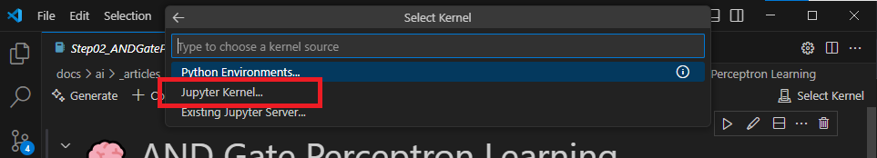

# Hands-on Setup
## For **VSCode** with the [**Jupyter Extension**](https://marketplace.visualstudio.com/items?itemName=ms-toolsai.jupyter)  

<br>

1. Check your Python version first
   
    ```bash
    py -0p
    ```
    

<br>

2. Create a virtual environment and activate it
    ```bash
    # Create a virtual environment
    # e.g., py3-jupyter-lg2t
    py -3.12 -m venv py3-jupyter-lg2t

    #  Go to the "py3-jupyter-lg2t"
    cd py3-jupyter-lg2t
    ```

    ```bash
    # Activate the environment on Windows
    .\Scripts\activate
    ```
    

<br>
    
3. Upgrade pip to the latest version
    ```bash
    # Optional: Check the current pip version
    pip -V

    # Upgrade pip
    python -m pip install --upgrade pip
    ```

4. Install dependencies:
    ```bash
    # Place requirements.txt into the "py3-jupyter-lg2t" folder
    # Then run the following command
    pip install -r requirements.txt
    ```

5. Install kernel to enable code execution on VSCode
    ```bash
    # Check available kernels
    jupyter kernelspec list

    # Install the kernel
    # e.g., kernel-py3-jupyter-lg2t
    ipython kernel install --name "kernel-py3-jupyter-lg2t" --user

    # Verify the kernel installation
    jupyter kernelspec list
    ```
    <br>

    Select the kernel **kernel-py3-jupyter-lg2t**,  

    
    
    

    **※ If the kernel does not appear in the list, try to refresh or restart VSCode.**
    
    <br>

    


<br><br>

Uninstall the kernel if needed
```bash
# List installed kernels
jupyter kernelspec list

# Uninstall the kernel
#jupyter kernelspec uninstall "kernel-py3-jupyter-lg2t" -y

# Verify kernel list again
jupyter kernelspec list
```
